# 👋 Hi, I’m @PAdventures

I'm a student at the Univeristy of Southampton studying Computer Science w/ AI.
I mostly just code random stuff and mess around with lanaguges.
However, I do occasionally program "serious" projects where I will use git and document code (when I remember too).

  
Need to know my real name?

  no lmao

### What do I do when I'm not coding?

- Studying at Univerity
- Running 🏃
- Gaming 🎮
- Hiking (rarely)

*I do tend to forget to update my profile, so it may be out of date*

## My Stack

### Languages
       

### JavaScript Runtimes
 

### Databases and ORMs
   

### Web Frameworks

### Text Editors / IDEs
   

### Platforms

## Random Stats
 
  

<!---
PAdventures/PAdventures is a ✨ special ✨ repository because its `README.md` (this file) appears on your GitHub profile.
You can click the Preview link to take a look at your changes.
--->
